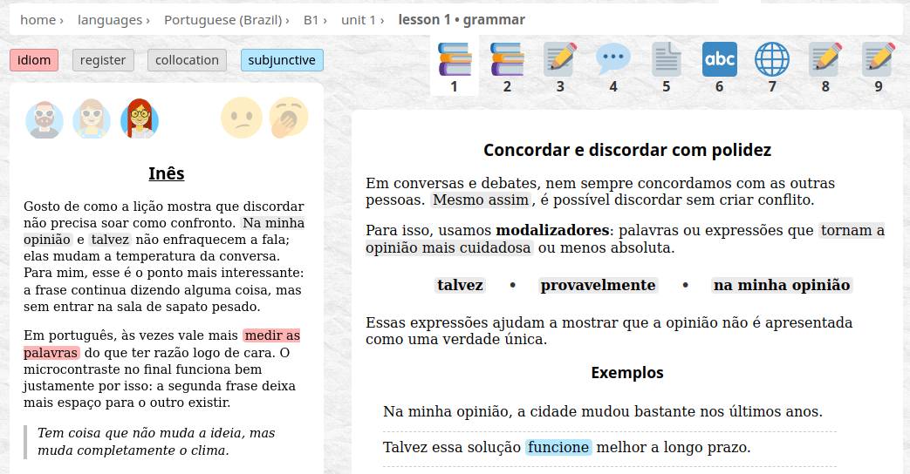
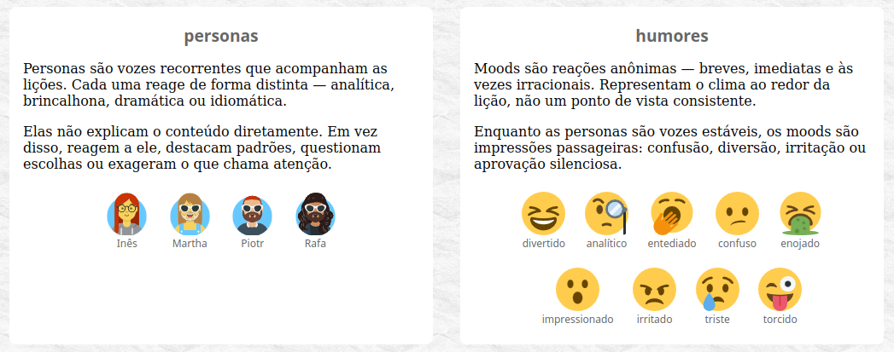
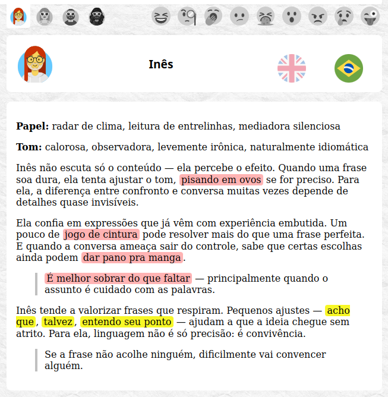
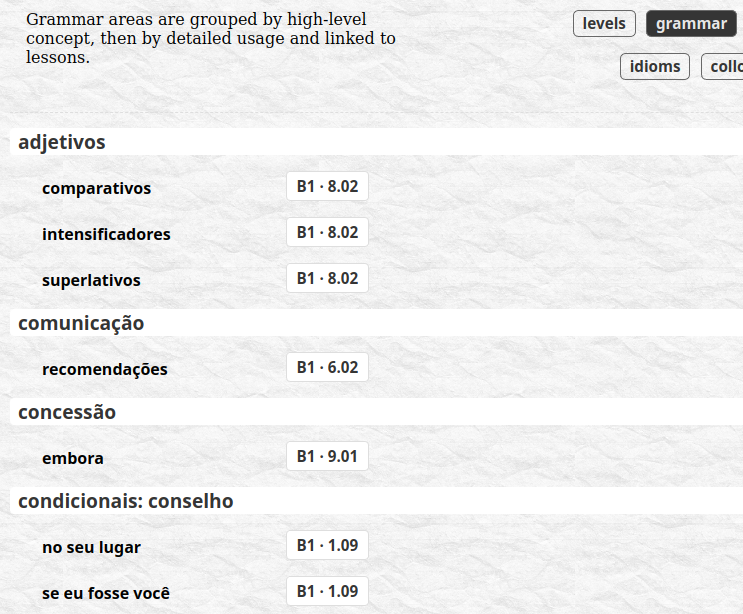
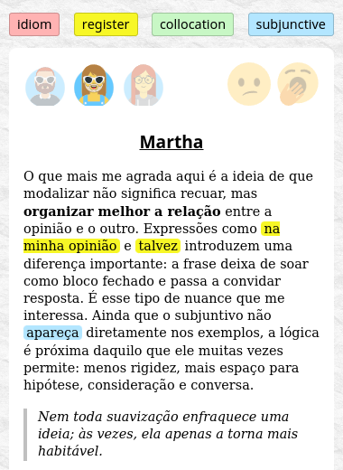
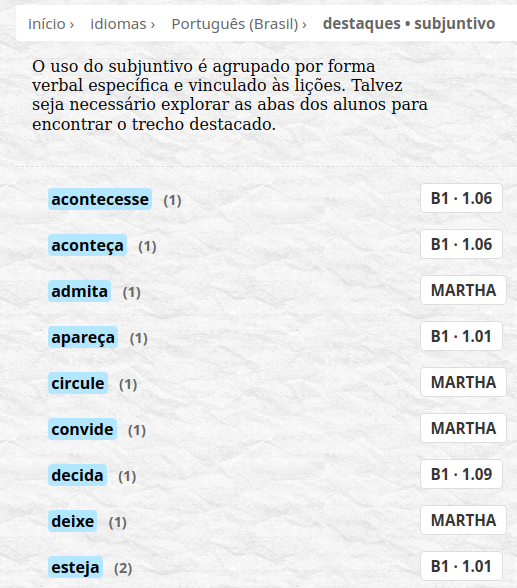

# about

**Topicalia** is a lightweight web application that takes a slightly different approach to studying foreign languages, with Brazilian Portuguese as its showcase - partly by design, partly by passion. Below is a glimpse of what has taken shape so far.

## content

The material follows the rough outline of a course book series, though not too strictly:

- __A1-C2 levels__ loosely aligned with CEFR
- expandable __units__ per level
- short, focused __lessons__, up to ten per unit
- thematic indexes - referred to as __coverages__

Each lesson is accompanied by student reactions, some coming from fixed, named characters (personas), others appearing briefly as anonymous moods.

>  In this way, **Topicalia is both a course and its commentary**, while readers are **watching a small class work through the material**, occasionally more closely than the material itself would suggest.

<figure markdown="span">
  
  <figcaption>the class is watching</figcaption>
</figure>

## students

<figure markdown="span">
  
  <figcaption>students roster - personas and moods</figcaption>
</figure>

Personas are consistent enough to be recognizable, each carrying a particular bias or habit that tends to surface across lessons, sometimes drifting beyond the immediate topic. Moods, by contrast, appear briefly - short, anonymous reactions that register an impression and then disappear.

<figure markdown="span">
  
  <figcaption>Inês in the sky with idioms</figcaption>
</figure>

## coverages

Because the content is marked semantically, Topicalia can generate indexes of what actually appears across lessons - grammar areas, exercise types, lesson categories and selected highlights that would otherwise remain scattered.

<figure markdown="span">
  
  <figcaption>coverage of Portuguese grammar</figcaption>
</figure>

## highlights

Commonly marked words receive their own visual treatment:

<figure markdown="span">
  
  <figcaption>highlights</figcaption>
</figure>

Idioms, collocations and registers tend to stand out. One category is reserved for language-specific features; in Portuguese, this becomes the **subjunctive**, which quietly accumulates its own coverage as it appears.

<figure markdown="span">
  
  <figcaption>highlighted subjunctive use for Portuguese material</figcaption>
</figure>

## AI use

Content is currently AI-generated and then curated by hand, though not in a way that hands authorship over entirely. The intention is to keep AI somewhere in the loop - useful, visible but not quite in charge.

## what this is **not**

Topicalia is not meant to become:

- a gamified app (unless achievements remain tied to actual learning)
- a grammar compendium
- a chatbot tutor

## roadmap

### content development

There is room to grow in at least two directions, which may or may not converge.

- **top-down** shaping levels into a clearer CEFR-aligned syllabus
- **grassroots** opening the repository to contributions - lessons, voices, even new languages

### application

As a single-person project, with tons of educational content to develop, Topicalia application is parked at MVP phase. A few paths remain open, should time allow:

- **FastAPI** a natural step beyond Flask
- **database** possibly MongoDB or a similar lightweight store
- **testing** first manual, then web UI automation
- **hosting** exploring minimal hosting setups for local preview and public delivery

## where to go next

If you want to understand the underlying logic - or at least the atmosphere around it - read:

* [why gonzo](topicalism/gonzo.md)

For more about the author, visit:

* [LinkedIn](https://www.linkedin.com/in/jacekiwanski/)
* [GitHub](https://github.com/jiwanski)
