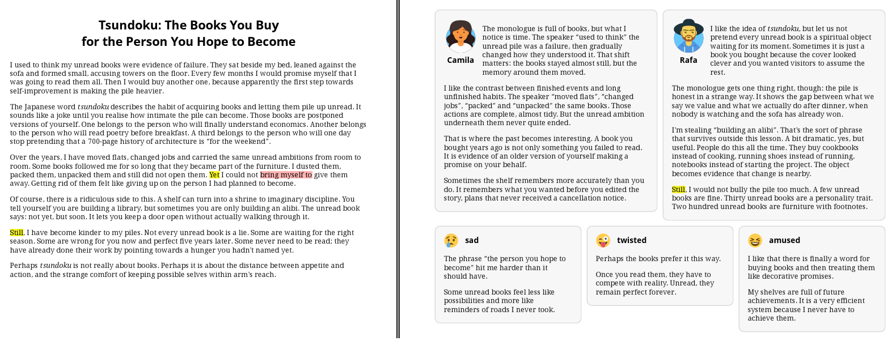
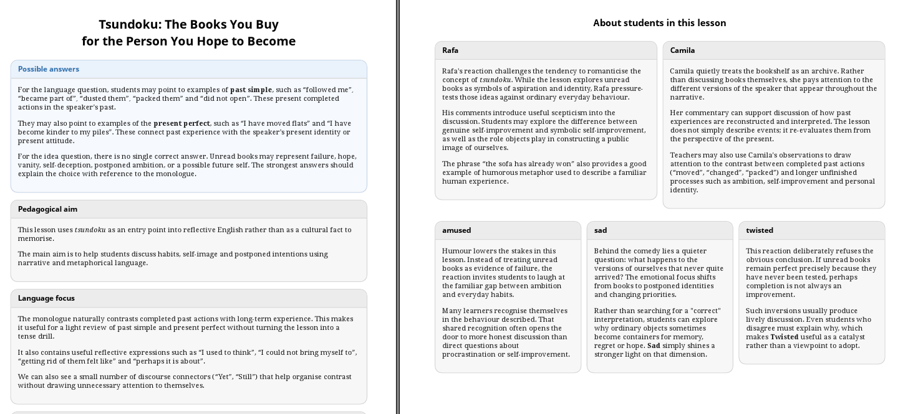
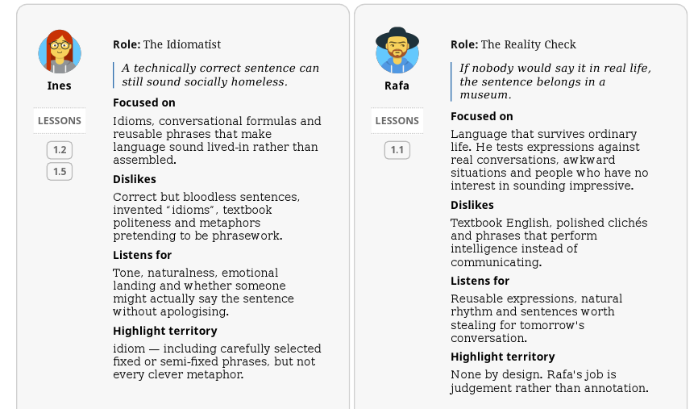
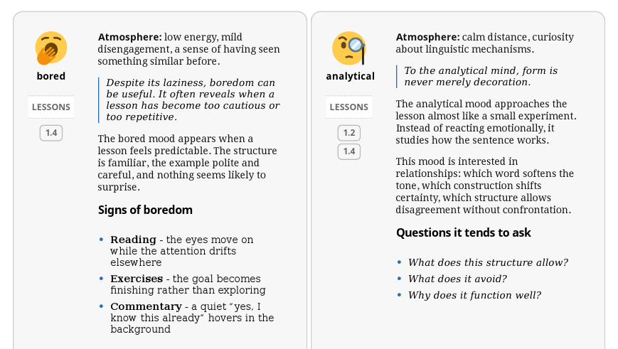
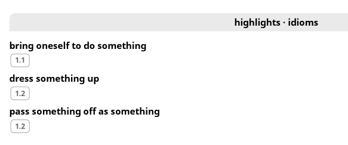

**Topicalia** is a small publishing experiment for language learning.

It produces short PDF "courselets", built around topical lessons and recurring voices. A lesson begins with a word, a scene or a small cultural idea, which then starts to stir its classroom into creative trouble. Yes, _its_ classrom, not _you, the readers_ classroom.

A typical courselet comes as student and teacher editions — with a twist.


<div class="grid cards" markdown>

-   :material-book-open-page-variant:{ .lg .middle } __Student edition__

    ---

    short lessons, voice reactions, class chronicles and appendices for student roster and patterns noticed along the way

-   :material-school:{ .lg .middle } __Teacher edition__

    ---

    answer keys, teaching notes and observations on class behaviour

</div>

<figure markdown="span">
  { .on-glb }
  <figcaption>a small editorial cast reacts to the lesson from different angles</figcaption>
</figure>

<figure markdown="span">
  { .on-glb }
  <figcaption>here is how the teacher gets involved</figcaption>
</figure>

## first demo

**Japan 1** courselet demonstrates an English class on B2 level and features five lessons built around Japanese words: <em>tsundoku</em>, <em>wabi-sabi</em>, <em>ikigai</em>, <em>omotenashi</em> and <em>kintsugi</em>.

[download _Japan 1_ student edition (PDF)](https://github.com/jiwanski/topicalia2-notes/releases/download/japan-1-demo/topicalia-japan1-student.pdf){ .md-button }

[download _Japan 1_ teacher edition (PDF)](https://github.com/jiwanski/topicalia2-notes/releases/download/japan-1-demo/topicalia-japan1-teacher.pdf){ .md-button }

## lesson structure

A Topicalia lesson is brief by design but it gets new lives when the core part introduces the topic and leaves, passing the ball to Topicalia class.

```text
lesson
  -> follow-up question
  -> persona reactions
  -> mood reactions
  -> class chronicle
  -> teacher notes on lesson
  -> teacher comments about selected class reactions
```

## the class

**Personas** are recurring language critics. Each one notices something different:

<div class="grid cards" markdown>

-   __Ines__
    collects living phrasework and distrusts polished sentences nobody would actually say.

-   __Camila__
    treats memory like an archive and watches how speakers reconstruct the past.

-   __Piotr__
    follows connectors, contrast and the small bridges that stop arguments collapsing.

-   __Rafa__
    pressure-tests language against ordinary life.

</div>

Other voices may join the board too: Martha qualifies certainty, Claire retells stories, Samir explores the paths opened by <em>if</em> and Ethan keeps rewriting until a sentence simply stays with you.

**Moods** are different. They are brief emotional readings of the same lesson: amused, analytical, bored, confused, impressed, irritated, sad and twisted. They arrive, leave a mark and disappear without judging further.

[read more about what influenced this approach](topicalism/gonzo.md){ .md-button }

Entire class roster is available as first appendix.

<figure markdown="span">
  { .on-glb }
  <figcaption>meet personas...</figcaption>
</figure>

<figure markdown="span">
  { .on-glb }
  <figcaption>...and moods</figcaption>
</figure>

## appendices

Topicalia marks selected language features inside the content. Those marks can later become appendices: idioms, connectors, grammar areas, lesson types and other patterns that would otherwise remain scattered.

The rule is deliberately freeform. An appendix should collect useful language, not every shiny object that impresses on the language route.

<figure markdown="span">
  { .on-glb }
  <figcaption>highlights become indexes when the dust settles</figcaption>
</figure>

## what comes next

The next planned courselet is **Brasil 1** in Portuguese, aimed to bring Brazilian words, tropical flavours and lusophonic beauty. It will also awaken _Martha_ character, who has been waiting politely near the subjunctive zone and may finally get busy with her beloved grammar structure.

Also planned is a follow-up to **Japan 1**, which will zoom in rather than move on, with a whole new unit around a single word, <em>gaman</em>, exploring patience, endurance, pressure, silence and self-control.

## behind the scenes

Topicalia data is stored as HTML fragments, organized with JSON structures and transformed into PDF files by a small Python/Flask toolchain, using WeasyPrint as final renderer. There is a localization layer, which allows to switch user interface to another supported language, e.g. Spanish.

While content development uses AI assistance heavily, the final material is edited and curated by hand.

## links

- [LinkedIn showcase](https://www.linkedin.com/showcase/topicalia/?viewAsMember=true)
- [LinkedIn project creator](https://www.linkedin.com/in/jacekiwanski/)
- [GitHub](https://github.com/jiwanski)
