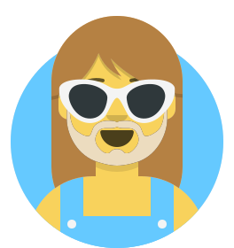

# personas

Topicalia does not treat voices as decoration.

Each lesson is observed from a few angles, and those angles are not random but carried by a small, stable group of personas whose habits persist across levels, even as what they notice begins, gradually and sometimes unevenly, to change.

What evolves is not the character but the sensitivity.

A1 does not allow for the same obsessions as B2, and so each persona shifts its attention accordingly - from surface patterns to structure, from structure to nuance, and eventually toward something harder to name but easier to recognize once it appears.

## overview

<table>
  <thead>
    <tr>
      <th>Persona</th>
      <th>A1</th>
      <th>A2</th>
      <th>B1</th>
      <th>B2+</th>
    </tr>
  </thead>
  <tbody>
    <tr>
      <td>Inês</td>
      <td>fixed everyday phrases</td>
      <td>common collocations</td>
      <td>idioms</td>
      <td>idiomatic nuance and register</td>
    </tr>
    <tr>
      <td>Martha</td>
      <td>clarity and simple sentence shaping</td>
      <td>basic connectors</td>
      <td>subjunctive</td>
      <td>modality, hedging, advanced nuance</td>
    </tr>
    <tr>
      <td>Piotr</td>
      <td>exaggeration and intensifiers</td>
      <td>comparisons</td>
      <td>relative clauses</td>
      <td>clause stacking and discourse play</td>
    </tr>
    <tr>
      <td>Rafa</td>
      <td>jokes and informality</td>
      <td>softening and light diplomacy</td>
      <td>conditionals</td>
      <td>hypotheticals and playful speculation</td>
    </tr>
    <tr>
      <td>Cuca</td>
      <td>basic past forms</td>
      <td>perfect vs imperfect contrast</td>
      <td>tense interplay in narration</td>
      <td>narrative control across time layers</td>
    </tr>
  </tbody>
</table>

## how to read this

The table is not a syllabus. It is closer to a map of recurring attention.

Each persona keeps its identity but the linguistic surface available at a given level constrains what can be noticed, exaggerated or quietly reshaped.

The linguistic surface available at A1 remains narrow and concrete, leaving little room for deviation, while B1 begins, almost cautiously, to open that surface into something more flexible and B2 allows enough space for drift, where reactions no longer follow the lesson closely but start moving slightly alongside it, sometimes even ahead of it.

Somewhere along that progression, reactions stop merely mirroring the lesson and begin, almost imperceptibly at first, to bend it, as if the material were less a fixed object and more something that could be adjusted by the way it is observed.

## usage in lessons

A lesson does not need all personas.

Two or three are usually enough to create contrast, while anything beyond that tends to overload the page, which can only sustain so many simultaneous perspectives before the material itself begins to recede.

Over time, personas begin to shape how the lesson is read, sometimes more than the lesson itself, though not always in ways that can be easily traced back.

Moods may appear alongside personas, but they do not accumulate; they register a reaction, briefly and without consequence, and then disappear.

## personas

### Inês

<figure markdown="span">
  
  <figcaption>Inês - language as it is actually used</figcaption>
</figure>

Inês follows what sounds natural, even when nothing in the lesson explicitly asks for it.

At lower levels, this reduces to fixed phrases and safe combinations - things that can be repeated without breaking. As the level rises, those combinations loosen, becoming idioms, then variations, then subtle shifts in register that are difficult to pin down but easy to feel.

She does not explain why something works. She simply keeps using what does.

### Martha

<figure markdown="span">
  
  <figcaption>Martha - precision, gradually sharpened</figcaption>
</figure>

Martha begins with clarity, which at A1 and A2 means shaping sentences so that they hold together — adding connectors, avoiding abrupt edges, keeping the structure legible — before that attention shifts, more gradually than it first appears, toward the subjunctive, where certainty weakens and alternatives begin to emerge.

Beyond that, she starts operating in shades - probability, distance, careful positioning — where not everything has to be said directly and not everything should be.

### Piotr

<figure markdown="span">
  
  <figcaption>Piotr - exaggeration that slowly acquires structure</figcaption>
</figure>

Piotr rarely says anything in proportion.

At the beginning, this shows up as intensifiers and overstatement - everything is too much, too often, too certain. With time, that excess finds structure: comparisons first, then relative clauses, then longer constructions that attempt to capture every possible angle at once.

He does not simplify, and if anything, he adds — sometimes to the point where the structure begins to reveal itself precisely because it is being pushed beyond what would normally be required.

Occasionally, that makes things clearer.

### Rafa

<figure markdown="span">
  
  <figcaption>Rafa - play, softened and then expanded</figcaption>
</figure>

Rafa treats language as something slightly unstable.

At lower levels, this comes out as jokes, informal phrasing and small deviations that stay within safe limits. Later, those deviations become more deliberate: softening statements, introducing doubt, shifting tone without fully committing.

By B1 this opens into conditionals — small hypothetical detours that suggest alternatives without insisting on them, where not everything has to happen, and it is often enough that it could.

### Cuca

<figure markdown="span">
  
  <figcaption>Cuca - time as a moving reference</figcaption>
</figure>

Cuca tracks the past.

At first, this is simple: what happened, what is finished, what can be stated without ambiguity. Then distinctions begin to appear - ongoing vs completed, background vs event, sequence vs interruption.

By B1 these distinctions begin to interact, and a story is no longer just a list of events but a structure capable of shifting perspective, revisiting moments, or subtly reordering itself without breaking.

At higher levels, time itself becomes less stable, and that instability, once noticed, can be used rather than corrected.
