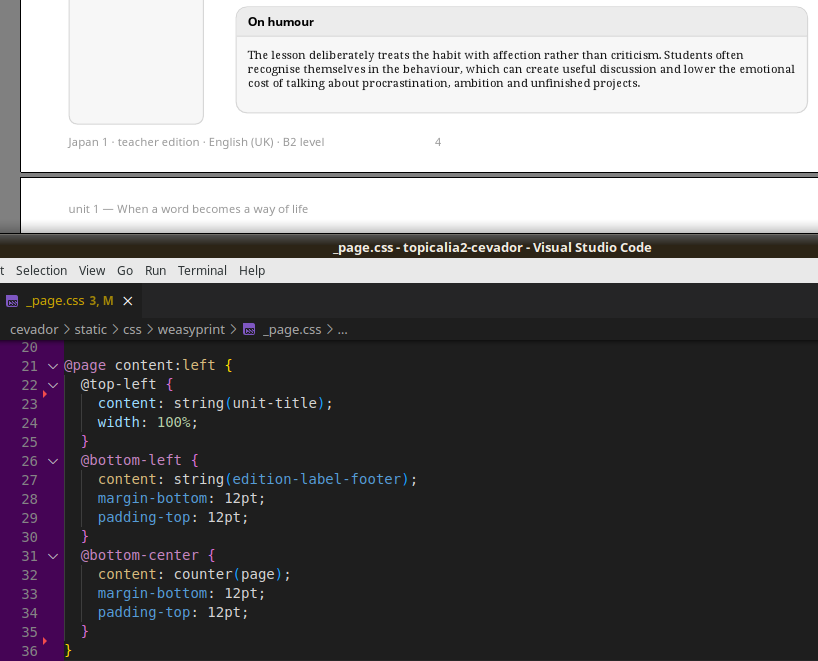

# To PDF with WeasyPrint

Topicalia began as a web application and its printable courselets originally relied on browser-generated PDFs. They worked well enough for quick prototypes, but every improvement in the editorial design - running headers, synchronized student and teacher editions, page numbering, etc. - pushed the browser further outside its comfort zone.

Out of many considered solutions, **WeasyPrint** gradually stopped feeling like a risky alternative and became the natural pipeline element:

````
HTML content + JSON metadata
        ↓
web app (Flask + Jinja)
        ↓
WeasyPrint
        ↓
Student and Teacher editions as PDF
````

The project still has a web UI, but today it serves mainly as an editorial tool, debugging preview and part of publishing process.

## why WeasyPrint?

Here is a subset of solved problems and publishing improvements. It is worth noting that although **Japan 1** demo used older 52.5 version, it was still able to implement a solid layout.

| PDF authoring               | browser (Chrome)            | WeasyPrint 52.5                         |
|-----------------------------|-----------------------------|-----------------------------------------|
| **running headers/footers** | limited, browser-controlled | fully customizable with `@page`         |
| **page numbering**          | limited, browser-controlled | flexible counters and references        |
| **named strings**           | x                           | supported with `string-set`, `string()` |
| **multiple page templates** | very limited                | easy (`@page`, named pages)             |
| **page areas**              | very limited                | rich support                            |
| **print preview issues**    | multiple                    | none (straight to PDF rendering)        |
| **deterministic output**    | browser-dependent           | stable within OS                        |
| **deployment**              | just browser                | Python environment                      |
| **CSS learning curve**      | standard CSS                | requires understanding paged CSS        |


## paged CSS

Most publishing features in Topicalia are created with ordinary CSS.

Running headers, footers and page numbers are defined using page areas and named strings instead of custom rendering Python code. That keeps the publishing layer remarkably small.

<figure markdown="span">
  { .on-glb }
  <figcaption>a named page template<br/>with running header, footer and page number</figcaption>
</figure>

## surprisingly little Python

One unexpected lesson from the project was that very little PDF-specific Python code was needed. Most layout decisions live where they arguably belong: in CSS. The Python layer assembles lesson content and metadata while WeasyPrint takes care of the book.

## links

* [WeasyPrint](https://weasyprint.org)
* [CSS Paged Media specification](https://www.w3.org/TR/css-page-3/)
